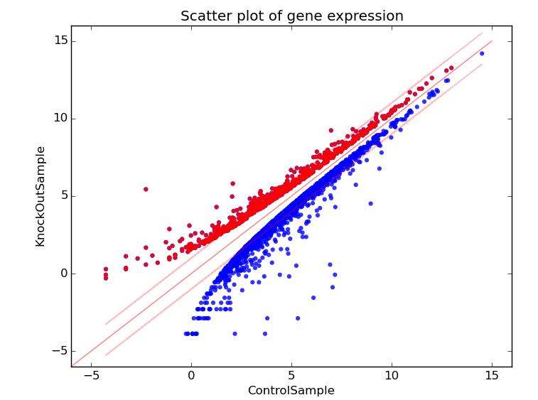

.. Oh My Genes documentation master file, created by
   sphinx-quickstart on Wed Mar 27 20:55:55 2019.
   You can adapt this file completely to your liking, but it should at least
   contain the root `toctree` directive.

Oh My Genes Documentation 
=========================

1. Golden (201732120168)
2. Dean (201732120164) 

Table of Contents 
=================

Introduction 
------------

Purpose 
+++++++

Overview 
++++++++

User Characteristics 
++++++++++++++++++++

Terminologies & Abbreviations 
+++++++++++++++++++++++++++++

Functional Requirements 
-----------------------

Input 
+++++

Output 
++++++

Table Analyzing 
***************

Plot Analyzing 
**************

Non-functional Requirements 
---------------------------
Response Time 
+++++++++++++
Aesthetic Aspects 
+++++++++++++++++
Confidentiality Policy 
++++++++++++++++++++++
Constraints 
-----------
Browser Compatibility 
+++++++++++++++++++++
Space Complexity 
++++++++++++++++
Budget 
++++++
System Downtime 
+++++++++++++++
Change Cases 
------------
Milestones 
----------
References 
----------
Group Information 
-----------------
Group Name 
++++++++++
Group Members 
+++++++++++++

.. toctree::
   :maxdepth: 2
   :caption: Contents:

Introduction 
++++++++++++
This document is intended to specify a set of requirements for the project OMG, which means “Oh My Genes”, a web application for identifying genes’ expression differential.

Purpose 
*******
The main purpose is to help biologists analyze their experiment data by identifying differentially expressed genes from gene expression file containing two sample cells, automatically and quickly.

Overview 
********
The web application is based on Flask framework for analyzing the difference between genes and it has a simple interface with a single button [Upload and Go] that accepts a gene expression in a text file with the correct format.

User Characteristics 
********************
The users are devoted biologists as well as researchers studying in the field of expression of genes and the website is maintained by technicians with basic knowledge on flask and python.

Terminologies & Abbreviations 
*****************************
Control sample - a cell sample prepared in its normal condition, without any defects. 
Treatment sample - a cell sample treated by special chemicals, or in which some genes are altered. 
Differentially expressed genes - the genes which have significantly different expression levels between two samples. 
Up-regulation - a gene is said to be up-regulated if it has higher expression in treatment than in control. 
LogFC - log fold change of gene expression. log_2 [T/C], where T is the gene expression level from a treatment sample, while C is the gene expression level from a control sample.
OMG – oh my genes, this is the name of the project.

Functional Requirements 
+++++++++++++++++++++++

Input 
*****
A valid submitted gene expression file has the following format: 
* It is a TAB-delimited, plain text file with three columns; 
* The file contains an optional head line, followed by each gene’s expression in a control sample (e.g., Control Sample) and in a treatment sample (e.g., Knock Out Sample). 
The file pattern is as follows:

+-------+---------------+----------------+
|gene_ID|  ControlSample|  KnockOutDample|
+=======+===============+================+
|AT1G010| 1.198558083   | 2.036161827    |
+-------+---------------+----------------+
|AT1G020| 13.75736234   | 13.370796      |
+-------+---------------+----------------+
|AT1G030| 0.833779536   | 0.203616183    |
+-------+---------------+----------------+
|AT1G040| 9.58846466    | 7.126566394    |
+-------+---------------+----------------+
|AT1G050| 23.81482799   | 21.10821094    |
+-------+---------------+----------------+
|AT1G070|  1.719670292  |  | 0.950208853 |                  
+-------+---------------+----------------+
 		
Output (Data Analyzing) 
***********************
The web application displays a table and a scatter plot when given a gene expression file.
Table Analyzing 
----------------------
The table contains a list of differentially expressed genes in the following format.

+----------+-----------------+----------------+----------+
| gene_ID  | ControlDample   | KnockOutSample |Log_2[FC] |
+==========+=================+================+==========+
| AT1G06463| 68.78681169     | 182.3043556    | 3.38     |
+----------+-----------------+----------------+----------+

Plot Analyzing 
--------------
The scatter plot displays differentially expressed genes, with the X-axis and the Y-axis as the Control and the KnockOut respectively. The up-regulated genes are shown in red dots whereas down-regulated genes are shown in blue.

   figure 1.0: Scatter Plot expressing the gene levels.

Non-functional Requirements 
+++++++++++++++++++++++++++
This section covers the non-functional requirements of the app for a preferable using experience.

Response Time 
*************
The web application is designed to serve biologists from the world over meaning the server will have to stand a heavy load of requests. This may weigh heavy on the system causing it to go down for some time or disable response to clients. Time complexity must be taken into consideration when the user has a huge amount of data to analyse. For good optimized experience, our algorithm should be sufficiently effective to deal with this situation. For most user cases we have decided the response time should be 5 seconds for a favourable experience in the worst-case scenario.

Aesthetic Aspects 
*****************
The interface should be as simple as possible since the web application’s function is to solve biological analysis. The graph should reflect the distinction between the control and treatment samples on the graph.

Confidentiality Policy 
**********************
As a public web application, the security of data must be a significant part to be considered. For biologists, every experiment result is confidential due to its sensitivity, therefore when users are using the application, their data must be used and stored securely. In other words, the web application must maintain the experiment data’s reliability, integrity and secrecy and the experimental data will not be accessed or shared without the agreement of the owner.
There are functions we wish to improve or add in order to improve the general user all round experience. For starters the system can set the threshold log_2FC automatically by itself. Also adding the capability to add multiple tables at once and then getting graph plotted for the different tables rather than having to enter one file at once. There is need also for a login and registration and administrative functions so that there is a hierarchy to show who accesses what and who can change what, this is so information integrity and security is maintained. Moreover, a database functionality would help so that our information is not scattered all over the web and previously accessed files can easily be retained without too much trouble. We would also like to be able to see the gene _id when we move the cursor over a scatter point, with the ability to click and be able to view the gene information. The security issue in this case though takes precedence over everything else since this information might be too sensitive to be left unsecure.

Constraints 
+++++++++++
The application is designed to serve a large number of biologists all over the world, therefore, some constraints have to be taken into account.

Browser Compatibility 
*********************
Since the application has a very coverage, a cross platform compatibility must be considered. Thus, the application should be accessible through Firefox, Chrome, and Safari.

Space Complexity 
****************
Space complexity should be considered in terms of the size of the entire web application as well as the space occupied when the application starts analyzing data. It must have a total size of at most 1GBT and when the application starts analyzing the data, memory occupancy must be limited to a certain level to make sure the system works smoothly.

Budget 
******
The budget for the entire development process must be less than 10,000 USD.

System Downtime 
***************
The occurrence of system shutdowns should also be taken into consideration. The downtime must be less than less than 30 minutes per year, which maximizes the demand for the application due to its reliability.

Change Cases 
++++++++++++
In the near future, we might be able to support not only txt file, but Excel files as well

* (TBA) 

Milestones 
++++++++++
1. Submit SRS for review by Mar 27th.
2. Get design done by May 16th.
3. Get coding done by June 6th.

References 
++++++++++
Omg project by 宋一豪 and 徐宇泽 :  https://oh-my-genes.readthedocs.io/en/latest/

Group Information 
+++++++++++++++++

Group Name 
**********
Machinda Zvazvinhu

Group Members 
**************

1. Golden 201732120168: goldenmc@zjnu.edu.cn
2. Dean 201732120164:    deanmajaya@zjnu.edu.cn

Indices and tables
==================

* :ref:`genindex`
* :ref:`modindex`
* :ref:`search`
